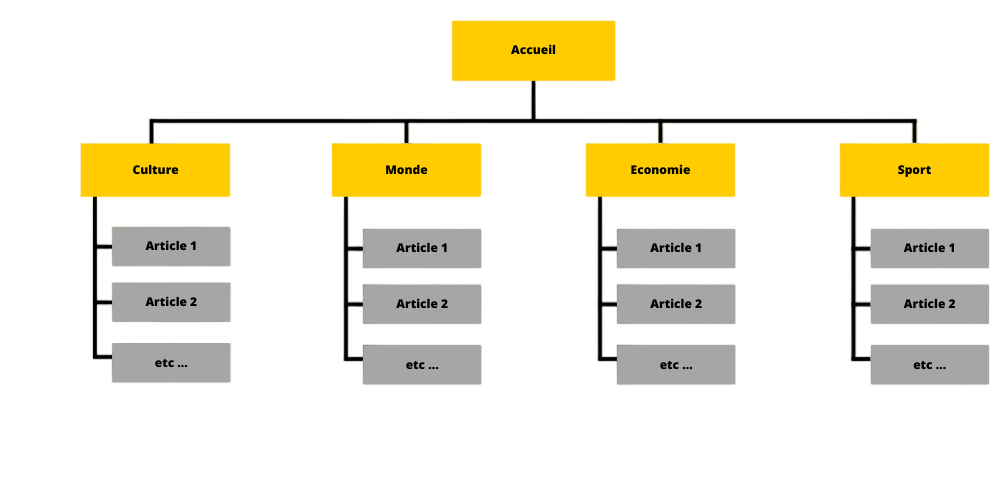

# Cahier des charges:

## Sommaire:

1.  [Contexte actuel](#contexte-actuel)
2.  [Arborescence des pages du site](#arborescence-des-pages-du-site)
3.  [Besoin](#besoin)
4.  [Spécifications fonctionnelles](#spécifications-fonctionnelles)
5.  [Spécifications techniques](#spécifications-techniques)
6.  [Livrables](#livrables)

# Contexte actuel

    Actuellement le journal Le Pays est tenu par Monsieur Do et le journal n'est disponible qu'en version papier

# Arborescences des pages du site

# Besoin

    Monsieur Do souhaite se moderniser,
    pour cela il veut mettre en place un site internet sous forme d'articles de presse qui
    doivent être facilement consulter,

# Spécifications fonctionnelles

    Le site devra être simple d'utilisation et proposer éxpérience de lecture agréables
    Les activités sportives et culturelle devronts être mises en avant
    Les articles de presse devront être facilement consultable
    La taxonomie doit permettre de naviguer de manière intuitive
    La page d'accueil devra présenter les articles de façon chronologique

# Spécifications techniques

    Le site devra être responsive sur mobile
    Le site devra répondre au normes d'accéssibilité
    Le site devra être sécurisé pour garantir la protection des données utilisateur

# Livrables

    Le site internet devra être fonctionel tout en répondant aux spécifications techniques
    Une documentation bien rédigé devra permettre de pouvoir installer le thème
